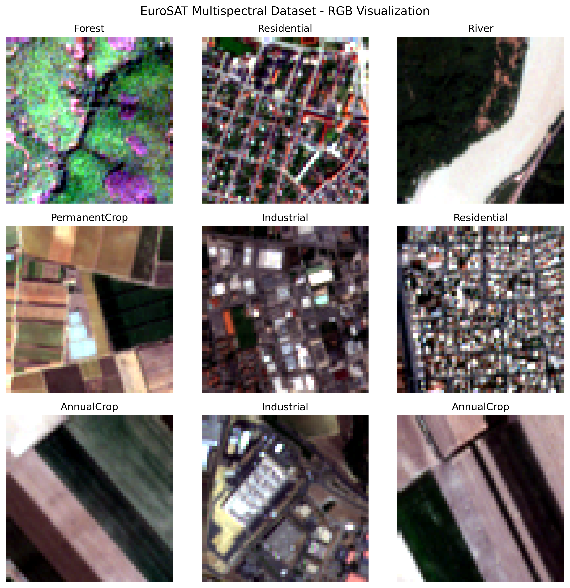
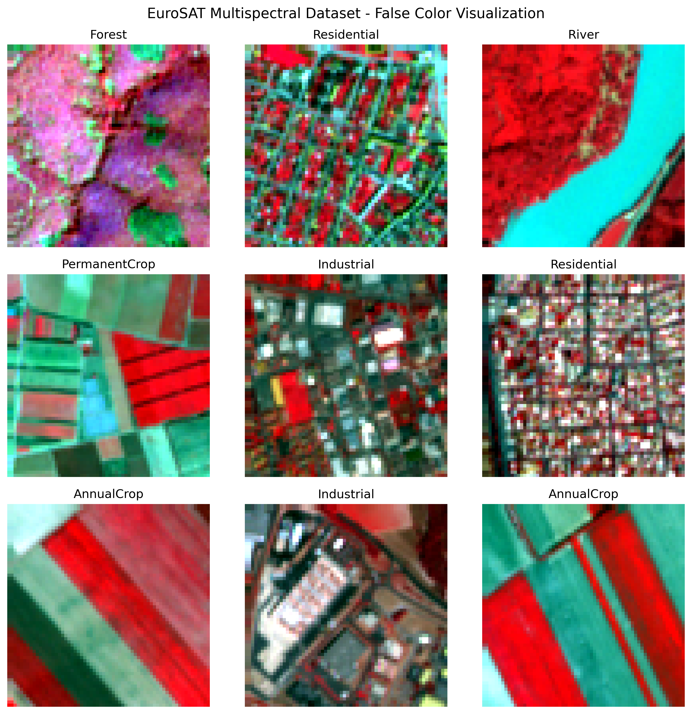
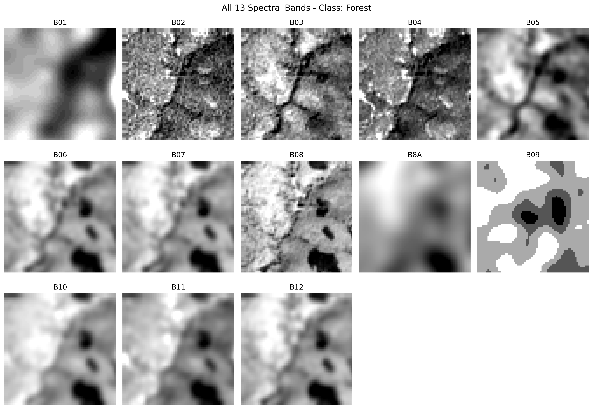
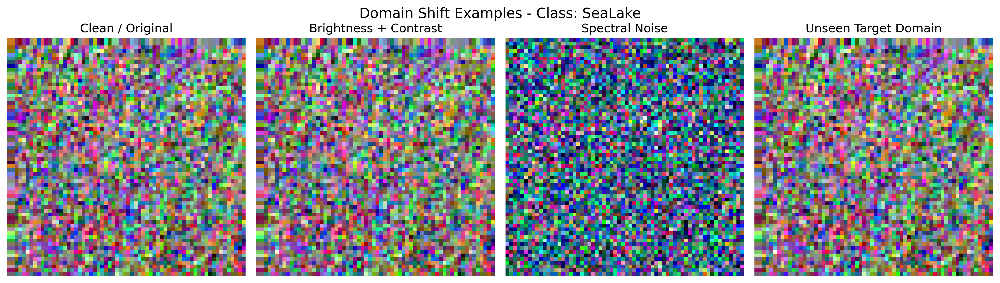
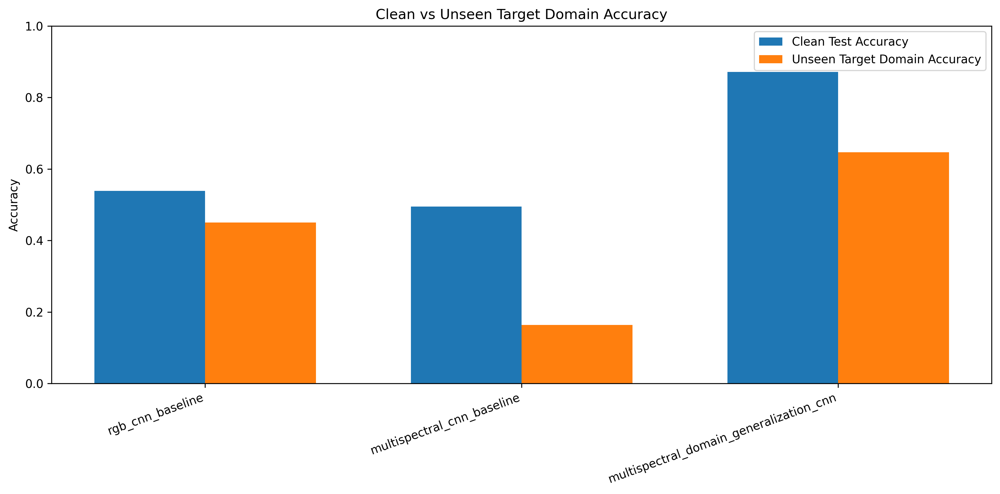

# EuroSAT Multispectral Domain Generalization Classification

This project implements a **multispectral domain generalization pipeline** for land-cover classification using the **EuroSAT multispectral Sentinel-2 dataset**.

The goal is to classify satellite images into land-cover categories while improving robustness against unseen domain shifts such as spectral changes, brightness/contrast variations, noise, and band degradation.

Unlike standard RGB image classification, this project uses **13 Sentinel-2 spectral bands**, making it suitable for remote sensing and multispectral image analysis.

---

## Project Overview

This project compares three models:

1. **RGB CNN Baseline**
   - Uses only RGB bands: B04, B03, B02.

2. **Multispectral CNN Baseline**
   - Uses all 13 Sentinel-2 bands.

3. **Multispectral Domain Generalization CNN**
   - Uses all 13 bands.
   - Trained with domain randomization techniques such as brightness/contrast shifts, spectral noise, and spectral scaling.

The main objective is to evaluate whether multispectral domain randomization improves performance on an **unseen target domain**.

---

## Dataset

The project uses the **EuroSAT multispectral dataset**, which contains Sentinel-2 satellite image patches.

- Dataset: EuroSAT MS
- Number of images: 27,000
- Number of classes: 10
- Image size: 64 × 64
- Number of channels: 13 multispectral bands

Classes:

- AnnualCrop
- Forest
- HerbaceousVegetation
- Highway
- Industrial
- Pasture
- PermanentCrop
- Residential
- River
- SeaLake

The dataset is downloaded directly inside the Google Colab notebook.

---

## Dataset Visualization

### RGB Samples



### False-Color Samples



### Example of All 13 Spectral Bands



---

## Domain Generalization Setup

Since EuroSAT does not provide explicit source and target domains, this project creates synthetic domain shifts to simulate different satellite imaging conditions.

The source domains include:

- Clean/original images
- Brightness and contrast shifted images
- Spectral noise images
- Spectral scaling variations

The unseen target domain includes:

- Strong spectral shift
- Brightness shift
- Band degradation/band drop

The target domain is not used during training. It is only used for evaluation.

### Domain Shift Examples



---

## Models

### 1. RGB CNN Baseline

This model uses only three Sentinel-2 bands:

- B04 as Red
- B03 as Green
- B02 as Blue

It represents a standard RGB image classification baseline.

### 2. Multispectral CNN Baseline

This model uses all 13 Sentinel-2 bands as input.

Input shape:

```text
64 × 64 × 13
```

### 3. Multispectral Domain Generalization CNN

This model also uses all 13 bands but is trained with domain randomization. During training, the model sees different augmented versions of multispectral images, helping it become more robust to unseen domain shifts.

---

## Experimental Setup

The project was implemented in a single Google Colab notebook.

For faster experimentation, the final reported run used quick mode with a balanced subset:

| Split | Number of Samples |
|---|---:|
| Train | 7,000 |
| Validation | 1,500 |
| Test | 1,500 |

The full dataset contains 27,000 images and can also be used by disabling quick mode in the notebook.

---

## Results

The models were evaluated on:

1. Clean test set
2. Unseen target domain test set

| Model | Clean Accuracy | Target Accuracy | Accuracy Drop | Clean F1 Macro | Target F1 Macro |
|---|---:|---:|---:|---:|---:|
| RGB CNN Baseline | 0.5387 | 0.4500 | 0.0887 | 0.5349 | 0.4276 |
| Multispectral CNN Baseline | 0.4947 | 0.1633 | 0.3313 | 0.4811 | 0.1136 |
| Multispectral Domain Generalization CNN | **0.8713** | **0.6467** | 0.2247 | **0.8710** | **0.6092** |

The domain generalization model achieved the best performance on both the clean test set and the unseen target domain.

### Model Comparison



---

## Evaluation on Unseen Target Domain

### Confusion Matrix


### Per-Class F1 Score


### Sample Predictions


---

## Repository Structure

```text
EuroSAT-Multispectral-Domain-Generalization/
│
├── notebooks/
│   └── Multispectral-Domain-Generalization.ipynb
│
├── assets/
│   ├── rgb_samples.png
│   ├── false_color_samples.png
│   ├── all_13_bands_sample.png
│   ├── domain_shift_examples.png
│   ├── model_comparison_accuracy.png
│   ├── confusion_matrix_unseen_target.png
│   ├── per_class_f1_unseen_target.png
│   └── sample_predictions_unseen_target.png
│
├── results/
│   ├── stage3_training_summary.csv
│   ├── stage4_metrics_summary.csv
│   └── model_comparison_table.csv
│
├── README.md
├── requirements.txt
└── .gitignore
```

---

## How to Run

The project is designed to run in Google Colab.

1. Open the notebook:

```text
notebooks/Multispectral-Domain-Generalization.ipynb
```

2. Run the cells in order.

3. The notebook will:
   - Download the EuroSAT multispectral dataset
   - Extract and read TIFF images
   - Visualize multispectral samples
   - Create synthetic domain shifts
   - Train three CNN models
   - Evaluate the models on clean and unseen target domains
   - Save metrics and visual outputs

---

## Requirements

The main dependencies are:

```text
tensorflow
numpy
pandas
matplotlib
scikit-learn
tifffile
tqdm
```

Install them with:

```bash
pip install -r requirements.txt
```

---

## Notes

The dataset and trained model checkpoints are not included in this repository because of their large size.

The dataset is downloaded automatically inside the notebook.

The following files are intentionally ignored:

- Dataset files
- ZIP files
- TIFF images
- Model checkpoints
- Local cache files

---

## Main Takeaway

The results show that applying domain randomization to multispectral satellite images can improve robustness under unseen spectral domain shifts.

The **Multispectral Domain Generalization CNN** significantly outperformed both the RGB baseline and the standard multispectral CNN baseline on the unseen target domain.
